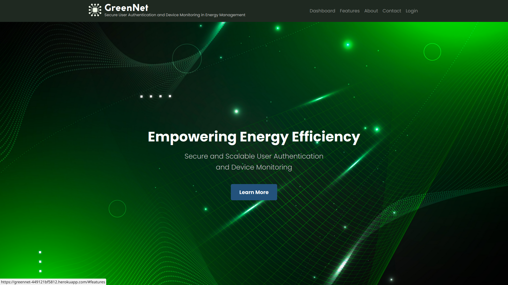

# **GreenNet: A Micro-service Based Platform for Secure User Authentication and Device Monitoring in Energy Management**

## **Introduction**

GreenNet is a micro-service based platform designed to provide secure user authentication and device monitoring for energy management systems. The platform aims to ensure the secure and efficient management of users and devices, enabling a reliable and scalable energy management system.

**Deployed Site:** [GreenNet](https://greennet-449121bf5812.herokuapp.com/)

**Final Project Blog Article:** [Blog Article: Medium](https://medium.com/@x17-green/greennet-4287c9a49fc7) 

**Author(s) LinkedIn:** [Okoyen Ebisine Precious](https://www.linkedin.com/in/x17-green/)

## **Inspiration**

As the world shifts towards renewable energy sources, the need for efficient energy management systems has become increasingly important. However, existing solutions often lack secure user authentication and device monitoring capabilities, hindering the efficient management of energy resources. GreenNet aims to address this challenge by providing a micro-service based platform for secure user authentication and device monitoring in energy management.

## **Technical Challenge**

One of the significant technical challenges I faced was choosing the right database management system. Initially, I chose MongoDB, but as I dug deeper, I realised MySQL was a better fit for my Python-based project. This change in database management systems has improved the overall performance and scalability of my platform.

## **Technical Details**

### Backend Architecture

The backend architecture is built using Python, with the Flask framework providing a lightweight and flexible foundation for our micro-service based approach. I created two micro-services: user management and device management. The user management micro-service handles user authentication and authorisation, while the device management micro-service handles device registration, monitoring, and data analysis.

### Database Modeling

I used Flask-SQLAlchemy for database modeling, which allowed me to interact efficiently with my MySQL database. I designed the database schema to ensure data consistency, integrity, and scalability.

### Frontend User Interface

The frontend user interface is built using HTML, CSS, and Bootstrap, providing a responsive and user-friendly experience. I also added JavaScript scripts to enhance the interface and provide dynamic functionality.

### Deployment

I deployed my application on Heroku, which has provided a scalable and reliable platform for our micro-service based architecture.

## **Project Timeline**

### Progress

> I'd give myself a 7 out of 10 for the progress I've made this week. I've made significant strides in building the backend architecture, database modeling, and frontend user interface. However, I still have some work to do to ensure my platform meets the high standards I've set for it.

### Challenges

One of the biggest hurdles I faced was simply getting started. The project's scope was daunting, and I needed to define a clear direction for my development process. It took some time to wrap my head around it, but I'm glad I pushed through.

### Next Steps

Now, I'll continue working on the project, focusing on developing the micro-services and integrating the authentication and device monitoring components. I'm also looking forward to collaborating with peers and industry experts, learning from their experiences, and sharing my own knowledge to improve my project.

---
## **Installation**

1. Clone the repository: `git clone https://github.com/x17-Green/GreenNet.git`
2. Install dependencies: `pip install -r requirements.txt`
3. Create a virtual environment: `python -m venv venv`
4. Activate the virtual environment: `source venv/bin/activate`
5. Run the application: `python app.py`

### **Configuration**

1. Create a `.env` file with the following variables:
    - `FLASK_APP=app.py`
    - `FLASK_ENV=development`
    - `DATABASE_URL=postgresql://[your_database].db`
2. Update the `config.py` file with your database configuration.
	- `SQLALCHEMY_DATABASE_URI = os.getenv('DATABASE_URL')`

## **Directory Structure**

- `config`: Configuration files
- `migrations`: Database migration files
- `models`: Data models
- `static`: Static files (CSS, JavaScript, images)
- `templates`: HTML templates
- `utils`: Utility functions
- `app.py`: Main application file
- `console.py`: Console script
- `Procfile`: Process file for deployment
- `README.md`: This file
- `requirements.txt`: Dependency list
- `runtime.txt`: Runtime configuration file

## **Usage**

### Create Account and Log In

1. Register for an account by providing username, password, and other required information.
2. Log in to the dashboard using your username and password.

### Add and Manage Devices

1. Register a new device by providing device information (name, type, location, etc.).
2. Manage your devices on the dashboard, including editing and deleting devices.

### Real-time Energy Data

1. View real-time energy data for each device on the dashboard.
2. Filter and sort energy data by device, date, or other criteria.

### Notifications and Alerts

1. Set custom thresholds for energy consumption or production.
2. Receive notifications and alerts when energy data exceeds custom thresholds.

### Energy Usage Statistics

1. View overall energy usage and production statistics on the dashboard.
2. Filter and sort statistics by date, device, or other criteria.

## **Contributing**

Contributions are welcome! If you'd like to contribute to GreenNet, please follow these steps:

1. Fork the repository: `git fork https://github.com/x17-Green/GreenNet.git`
2. Create a new branch: `git branch [feature/fix]`
3. Make changes and commit: `git commit -m "Description of changes"`
4. Push changes: `git push origin [feature/fix]`
5. Create a pull request: `git request-pull [feature/fix]`

## **Related Projects**

- [- African Energy Management System (AEMS) (Ghana))](https://afrienergyminerals.org/)
- [- AWS IoT Device Management](https://aws.amazon.com/iot-device-management/)

## **Licensing**

GreenNet is licensed under the [MIT License].

## **Screenshots**
#### Landing Page

#### Dashboard Screenshot

#### Login Screenshot

#### Register Screenshot

## **Conclusion**

GreenNet is a micro-service based platform for secure user authentication and device monitoring in energy management. I have faced technical challenges, including choosing the right database management system, and non-technical challenges, such as getting started with the project. Despite these challenges, I am committed to delivering a high-quality project that meets the required standards.