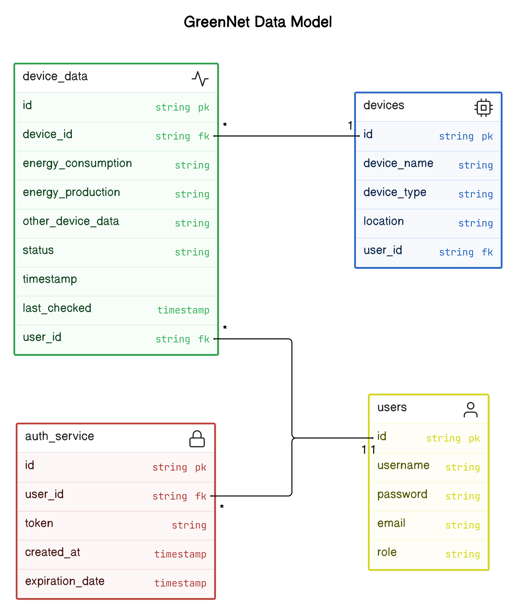

> This data model diagram provides a high-level overview of the data structures and relationships used in the GreenNet platform. It can be refined and modified as needed to accommodate additional requirements and use cases.

**Entities:**

1. **User**
    - `id` (primary key, unique identifier)
    - `username`
    - `password` (hashed for security)
    - `email`
    - `role` (e.g., administrator, energy company, utility provider)
2. **Device**
    - `id` (primary key, unique identifier)
    - `device_name`
    - `device_type` (e.g., smart meter, energy storage system)
    - `location` (e.g., latitude, longitude)
    - `user_id` (foreign key referencing the User entity)
3. **Device Data**
    - `id` (primary key, unique identifier)
    - `device_id` (foreign key referencing the Device entity)
    - `timestamp`
    - `energy_consumption` (e.g., kWh)
    - `energy_production` (e.g., kWh)
    - `other_device_data` (e.g., temperature, humidity)
4. **Authentication Token**
    - `id` (primary key, unique identifier)
    - `user_id` (foreign key referencing the User entity)
    - `token` (unique authentication token)
    - `expiration_date`

**Relationships:**

- A user can have multiple devices (one-to-many).
- A device is associated with one user (many-to-one).
- A device can have multiple device data entries (one-to-many).
- An authentication token is associated with one user (many-to-one).

**Notes:**

- The `password` field in the User entity is hashed for security reasons.
- The `device_data` table can be partitioned by device ID and timestamp for efficient querying and data retrieval.
- The `authentication_token` table can be used to implement token-based authentication for the GreenNet API.

The following diagram illustrates the data model for the GreenNet platform, showcasing the relationships between different entities and the data structures used to store information.

**Diagram**
